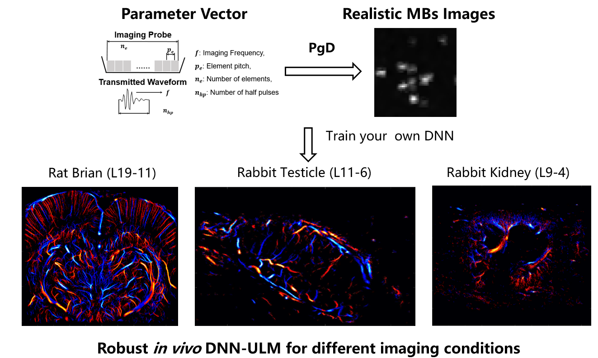

# Physical Parameter-Guided Diffusion Model for Ultrasound Localization Microscopy (PgD-ULM)

[](https://opensource.org/licenses/MIT)
[](https://www.python.org/downloads/release/python-380/)
[](https://pytorch.org/)

## Overview

This repository contains the official implementation of **Physical Parameter-Guided Diffusion (PgD)**, a framework for generating high-fidelity microbubble point spread functions (PSFs) under diverse ultrasound imaging conditions. Unlike conventional simulation methods, our approach explicitly incorporates physical imaging parameters (frequency, transducer element pitch, active elements count, and pulse configuration) into the diffusion generation process, enabling the synthesis of realistic training data for deep learning-based Ultrasound Localization Microscopy (ULM) without extensive experimental data collection.



</center>

**The Physical Parameter-Guided Diffusion for DNN-ULM**

## Key Features
* **High-similarity outputs**: High similarity of structure and width distributions of generated PSFs compared to the nonlinear experimenta MBs PSF. 
* **Parameter-guided generation**: Direct integration of physical ultrasound parameters into the diffusion process, allowing for generation of MBs under differetn conditions. 
* **Null parameter strategy**: Strategy to diverse imaging conditions with one datasets.

## Usage

### Command Line Interface

The repository provides a flexible command-line interface for generating microbubble PSFs with customizable parameters:

```bash
python generate_psfs.py \
  --num_samples 1000 \
  --sampling_method DDIM \
  --frequency 7.35 \
  --pitch 240 \
  --elements 128 \
  --pulses 2 \
  --save_path outputs/L11-6_probe/ \
  --guide_w 0.0 \
  --tau 10 \
  --save_format mat
```
A simple training dataset generation code has been provided, named  *example_for_training_dataset_generation_single_frame.m*
## Citation

The relevant manuscripts are currently under submission and review. We will provide citation information upon publication.

## Datasets
We will provide three *in vivo* datasets for validation upon publication:
1. **Rat brain dataset**: L19-11 probe (15.625 MHz) imaging of rat cerebral vasculature
2. **Rabbit testicle dataset**: L11-6 probe (7.35 MHz) imaging of rabbit testicular microvasculature
3. **Rabbit kidney dataset**: L9-4 probe (6.9 MHz) imaging of rabbit kidney microvasculature


## Contact 
For questions, suggestions, or collaboration opportunities, please contact:
[Yu QIANG] - yu.qiang@siat.ac.cn


This work was supported by State Key Laboratory of Biomedical Imaging Science and System, which also owns the copyright of this work. The authors would like to thank all contributors and collaborators for their valuable feedback and support.
